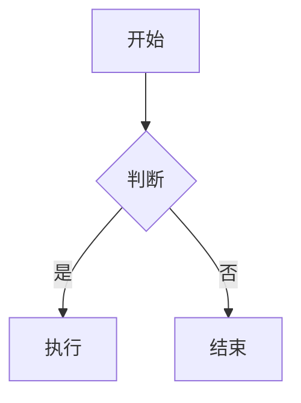

# 🚀 zzc-blog

> 个人技术博客，基于 [Hexo](https://hexo.io/) 构建，使用 [Butterfly](https://github.com/jerryc127/hexo-theme-butterfly) 主题。

🌐 **在线地址**：[https://zzcblog.dpdns.org](https://zzcblog.dpdns.org)

---

## ✨ 特性

- **Butterfly 主题** — 卡片式 UI，简洁美观
- **深色模式** — 跟随系统自动切换
- **本地搜索** — 全站文章即时搜索
- **字数统计** — 文章字数 / 阅读时长 / 总字数
- **文章封面** — 多张科技风封面随机展示
- **标签 / 分类** — 文章归类管理
- **RSS 订阅** — 支持 atom.xml
- **社交分享** — 微信 / 微博 / QQ
- **Mermaid 图表** — 流程图 / 时序图
- **PJAX 无刷新跳转** — 流畅的页面切换体验
- **Fancybox 灯箱** — 图片点击放大浏览
- **不蒜子统计** — UV / PV 站点访问统计

---

## 📁 项目结构

```
F:\HexoBlog
├── _config.yml              # 站点全局配置
├── _config.butterfly.yml    # Butterfly 主题配置
├── package.json             # 依赖管理
├── scaffolds/               # 文章模板
│   └── post.md
├── source/                  # 源文件
│   ├── _posts/              # 文章目录
│   │   ├── hello-world.md
│   │   └── JVM学习.md
│   ├── about/               # 关于页面
│   ├── img/                 # 图片资源
│   │   ├── cover/           # 文章封面图
│   │   ├── bg-tech.svg      # 网站背景
│   │   ├── footer-bg.svg    # 底部背景
│   │   ├── index.jpg        # Banner 大图
│   │   └── butterfly-icon.png # 头像 / favicon
│   ├── categories/          # 分类页
│   └── tags/                # 标签页
├── themes/
│   └── butterfly/           # Butterfly 主题
└── public/                  # 生成的静态文件（gitignore）
```

---

## 🛠️ 快速开始

### 环境要求

- Node.js >= 18
- pnpm >= 8

### 安装依赖

```bash
pnpm install
```

### 本地预览

```bash
pnpm run server
```

访问 http://localhost:4000 预览

### 创建新文章

```bash
pnpm run new "文章标题"
```

### 生成静态文件

```bash
pnpm run build
```

### 部署到 GitHub Pages

```bash
pnpm run deploy
```

---

## 📝 文章写作指南

### Front-matter 模板

```yaml
---
title: 文章标题
date: 2026-07-05 00:00:00
tags:
  - 标签1
  - 标签2
categories:
  - 分类1
cover: /img/cover/cover-code.png      # 封面图（可选，默认随机分配）
top_img: /img/index.jpg               # Banner 图（可选）
description: 文章简介                  # 首页显示的摘要
comments: true                        # 是否启用评论
---
```

### 内置标签插件

**Mermaid 流程图**
````markdown

````

**Note 提示块**
```markdown

这是一个提示信息

```

---

## ⚙️ 配置说明

详细配置手册见 [`source/butterfly-config-guide.md`](source/butterfly-config-guide.md)，也可以在博客中访问 `/butterfly-config-guide/` 查看。

### 核心配置

| 文件 | 用途 |
|------|------|
| `_config.yml` | 站点基本信息、URL、部署配置 |
| `_config.butterfly.yml` | 主题外观、功能开关 |

---

## 📦 已安装插件

| 插件 | 用途 |
|------|------|
| `hexo-deployer-git` | Git 部署到 GitHub Pages |
| `hexo-generator-search` | 本地搜索数据生成 |
| `hexo-wordcount` | 文章字数统计 |
| `hexo-generator-feed` | RSS 订阅生成 |
| `hexo-renderer-pug` | Pug 模板渲染 |
| `hexo-renderer-stylus` | Stylus CSS 渲染 |
| `hexo-renderer-marked` | Markdown 渲染 |

---

## 🚀 部署

博客通过 `hexo-deployer-git` 自动部署到 GitHub Pages：

```bash
hexo clean      # 清除缓存
hexo generate   # 生成静态文件
hexo deploy     # 推送到 GitHub
```

部署仓库：[zzc-blog/zzc-blog.github.io](https://github.com/zzc-blog/zzc-blog.github.io)

---

## 📄 许可证

- 文章内容采用 [CC BY-NC-SA 4.0](https://creativecommons.org/licenses/by-nc-sa/4.0/) 许可协议
- 主题 [Butterfly](https://github.com/jerryc127/hexo-theme-butterfly) 基于 Apache-2.0 许可

---

> 📬 如有问题或建议，欢迎在 [GitHub Issues](https://github.com/zzc-blog/zzc-blog.github.io/issues) 反馈
